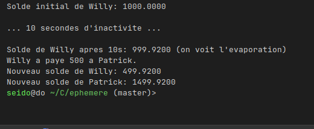

# Monnaie Éphémère

> Une monnaie vivante, conçue pour fluer, pas pour stagner.


## Exemple de code

```c++
#include <ephemeral.h>

int main() {
    Wallet *from = create_wallet("Willy", 1000.00);
    Wallet *to = create_wallet("Patrick", 1000.00);

    printf("Solde initial de Willy: %.4f\n", get_current_balance(from));

    printf("\n... 10 secondes d'inactivite ...\n\n");
    sleep(10); 

    printf("Solde de Willy apres 10s: %.4f (on voit l'evaporation)\n", get_current_balance(from));

    from->pay(from, to, 500);

    printf("Willy a paye 500 a Patrick.\n");
    printf("Nouveau solde de Willy: %.4f\n", get_current_balance(from));
    printf("Nouveau solde de Patrick: %.4f\n", get_current_balance(to));

    free(from);
    free(to);

    return 0;
}
```



## Philosophie

Le projet **Éphémère** est une exploration radicale de la nature de la valeur. Il propose un modèle de monnaie *
*anti-capitaliste** dont le but fondamental est de favoriser la **circulation de la richesse** et de décourager sa *
*thésaurisation**.

Contrairement aux monnaies traditionnelles qui peuvent être accumulées à l'infini, l'Éphémère est conçu pour imiter les
cycles du monde vivant. Sa règle principale est simple : **une richesse qui ne circule pas, qui ne sert pas la
communauté, retourne à son état de potentiel.**

Cette "disparition" n'est pas une destruction de valeur, mais une **transformation**. Elle s'inspire du concept de **"
Silence fertile"** : la valeur non utilisée s'évapore et retourne à un état de potentiel collectif, d'où elle pourra
renaître et être redistribuée, à la manière de l'eau qui s'évapore d'une flaque stagnante pour retomber en pluie
bienfaisante.

## Principes de Fonctionnement

Le système repose sur quelques règles simples mais puissantes :

* **Valorisation par le Flux** : La circulation est le moteur de l'économie. Non seulement une monnaie qui circule ne
  perd pas de valeur, mais l'acte même de l'échange peut en générer davantage, renforçant la vitalité du système.
* **Évaporation par Stagnation** : Un portefeuille inactif voit son solde diminuer progressivement avec le temps,
  suivant une courbe de décroissance exponentielle. Cette mécanique rend l'accumulation à long terme contre-productive.
* **Cycle Régénératif** : Le système est pensé pour fonctionner par cycles (par exemple, mensuels), où la valeur "
  évaporée" alimente une nouvelle distribution collective, assurant que le jeu ne s'arrête jamais.

## À Propos

Ce projet est une brique fondamentale de l'univers conceptuel du **Septénaire des Sols**, développé au sein de
l'organisation [chiffres](https://www.google.com/search?q=https://github.com/chiffres). Il sert de prototype pour
explorer les mécaniques d'une des facettes de la monnaie quantique et philosophique "Sols".

## Licence

Ce projet est sous licence **GNU Affero General Public License v3.0**. Cela signifie qu'il est et restera un logiciel
libre. Toute œuvre dérivée, en particulier si elle est accessible via un réseau, doit également partager son code
source.